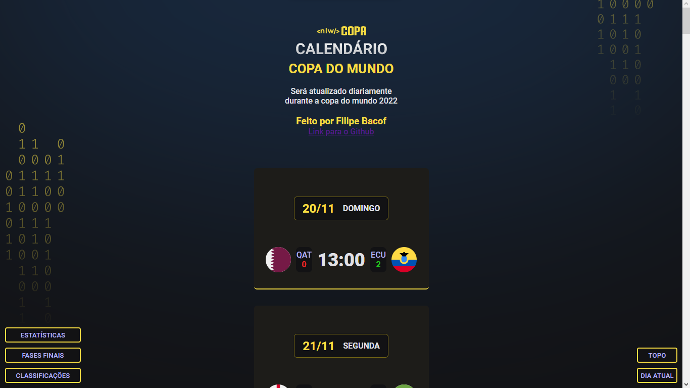
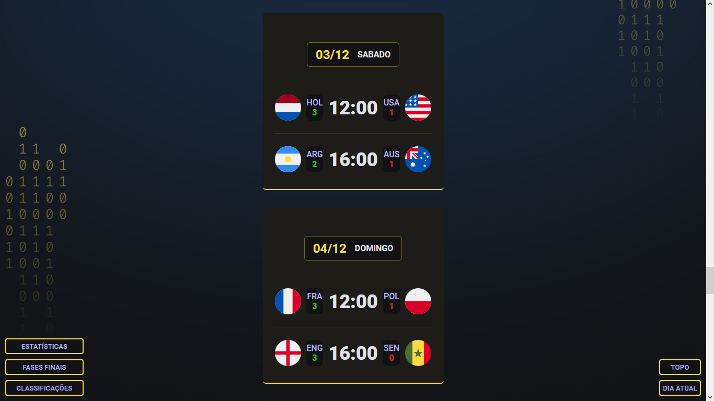
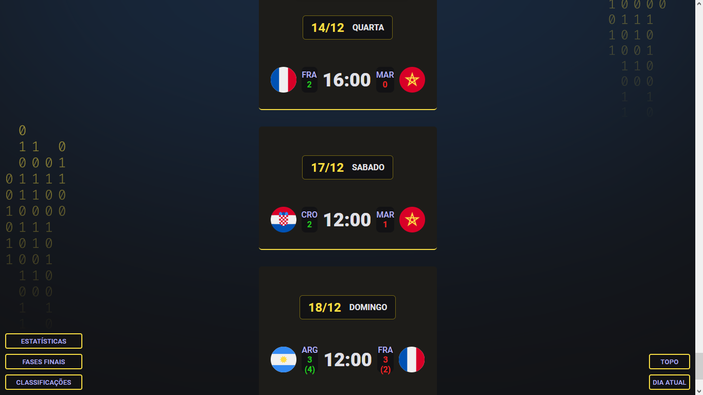
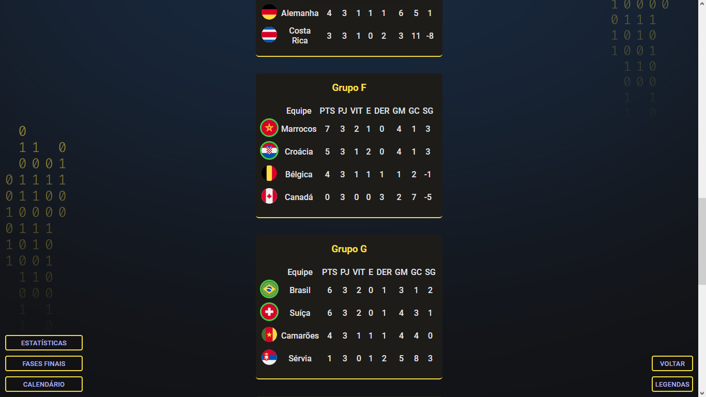
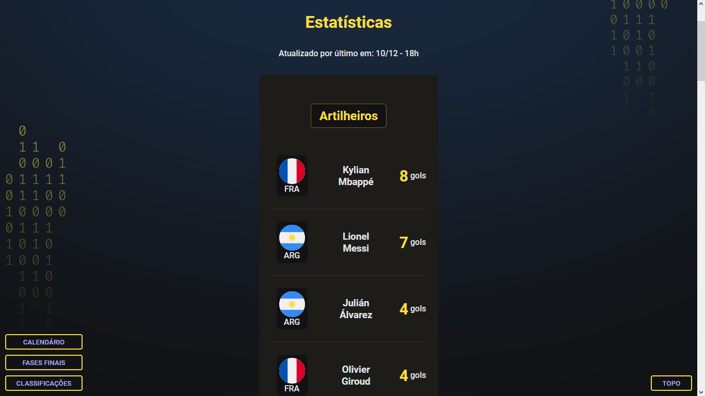
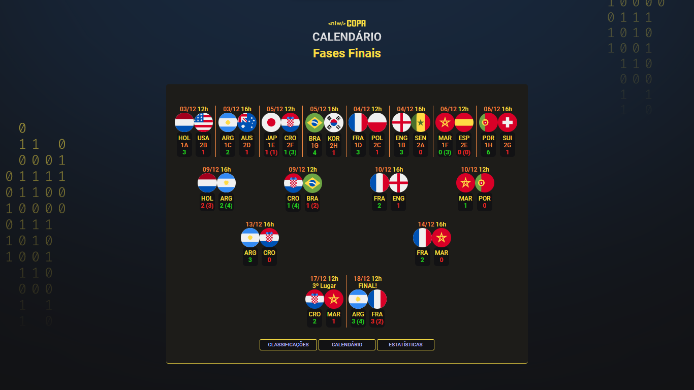

# Fases de desenvolvimento e aprendizados:

-   A tela principal do site foi criada durante o evento NLW (Next Level Week) da RocketSeat, onde o calendário foi desenvolvido, sendo assim, o design dos cards, temas e cores todas pensadas nessa etapa, mas eu não me contentei apenas com aquele calendário e quis praticar e codar mais, então comecei a ter várias idéias.
-   Uma dessas idéias foi de criar a tela com a tabela das fases de grupos, estatísticas (cartões, artilheiros) e também o gráfico de mata-mata, isso foi bastante difícil e bastante trabalhoso, principalmente a parte de atualizar as informações diariamente, devido não existir nenhuma API da copa do mundo com as informações.
-   Mesmo assim eu coloquei a mão na massa e criei primeiro a tela com as tabelas o site foi se aprimorando aos poucos, atualizando ele constantemente, o legal de utilizar GIT é que será possível visualizar cada uma das etapas de desenvolvimento desde o começo.
-   Inicialmente não apliquei Clean Code nenhum, na verdade foi apenas DIRTY CODE! porém refatorei boa parte das funções organizei a estruturação do código, coloquei todas as funções que geram as telas principais no começo, já que fica mais facil editar e atualizar pelo celular hahaha
-   Ao inves de ter 4 arquivos HTML um para cada tela, achei mais fácil colocar tudo na mesma tela e exibir elas manipulando a DOM com JavaScript, conforme ensinado pela rocketseat de diversas formas super didáticas.
-   Interessante de verdade foi adicionar a auto-rolagem para o site, ao abrir durante a copa no dia de determinado jogo, o site rolava sozinho para melhorar a experiencia do usuário.
-   Detalhe é que um dos processos mais trabalhosos foi escrever o JSON com os nomes dos jogadores, é possível visualizar ele ao clicar nas bandeiras de cada seleção, as informações foram extraídas diretamente do site da FIFA e demoraram quase 3 dias para serem adicionadas. Abaixo deixarei o link também para uma página do TABNEWS onde encontei alguém que tambem procurava por uma API mas resolveu criar ela e o JSON que eu escrevi pode ajudar de alguma forma.
-   https://www.tabnews.com.br/liverday/pitch-fiz-uma-api-rest-open-source-para-a-copa-do-mundo

# Melhores momentos da copa (minha opinião)

-   O Gol mais bonito com certeza foi o segundo gol do Richarlison na partida do Brasil contra a Sérvia.
-   A final foi bastante envolvente e os capitões de cada seleção mandaram muito bem, espetáculo de futebol!
-   A fala do Messi sobre o que a copa representa para a Argentina foi algo que me tocou e fez torcer pela Argentina pós eliminação do Brasil

# Prints das telas do projeto

